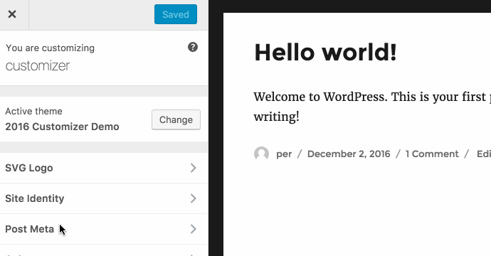
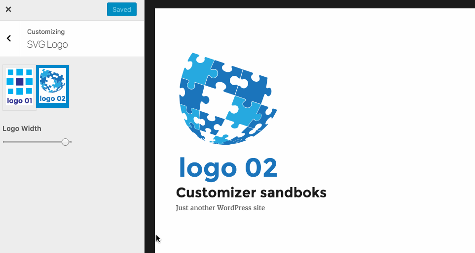

# A Customizer Demo Theme

This Twenty Sixteen child theme demonstrate the following **proof of concepts**:

1. How to use the customizer postmessage transport and a preview script to toggle complex theme elements on or off. ([learn more](https://soderlind.no/wordpress-customizer-demo-in-twenty-sixteen-toggle-post-meta-on-or-off/))
1. How to select and add an SVG logo. ([learn more](https://soderlind.no/a-svg-logo-custom-control-for-wordpress-customizer/))
1. Replaced WordPress customizer checkbox control with [Customizer Toggle Control](https://github.com/soderlind/class-customizer-toggle-control)

## Prerequisite

This demo is implemented as a child theme to [Twenty Sixteen](https://wordpress.org/themes/twentysixteen/), so Twenty Sixteen must be installed.

## Installation

You know the drill, [download](https://github.com/soderlind/2016-customizer-demo/archive/master.zip), install and activate the theme.

## Use

### Toggle complex theme elements on or off.

### SVG logo Custom Customizer Component

## Copyright and License

**2016-customizer-demo** is copyright 2016 Per Soderlind

**2016-customizer-demo** is free software: you can redistribute it and/or modify it under the terms of the GNU General Public License as published by the Free Software Foundation, either version 2 of the License, or (at your option) any later version.

**2016-customizer-demo** is distributed in the hope that it will be useful, but WITHOUT ANY WARRANTY; without even the implied warranty of MERCHANTABILITY or FITNESS FOR A PARTICULAR PURPOSE. See the [GNU General Public License](LICENSE) for more details.

You should have received a copy of the GNU Lesser General Public License along with the Extension. If not, see http://www.gnu.org/licenses/.
